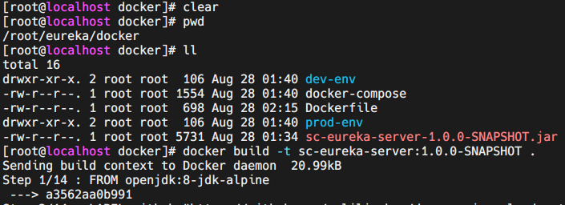
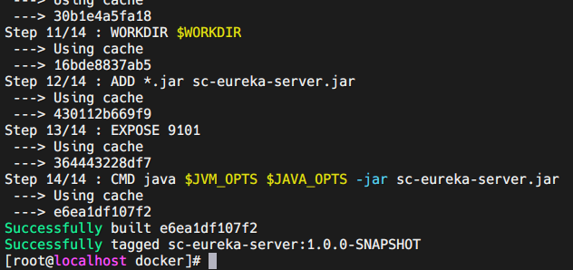
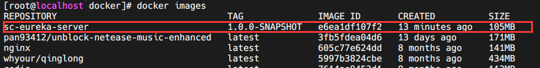
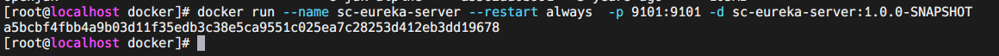
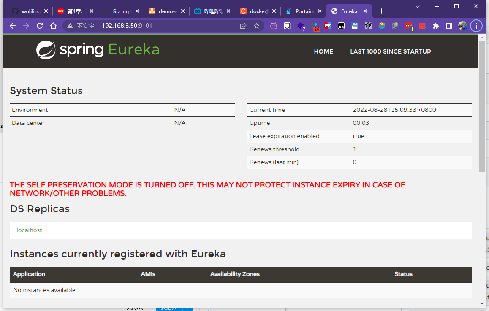
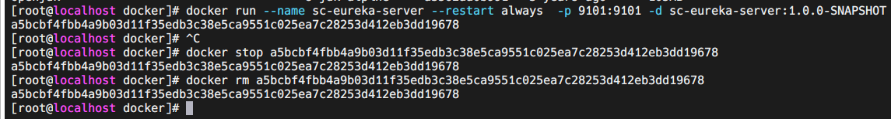
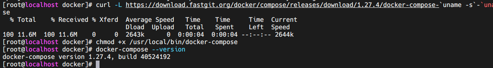
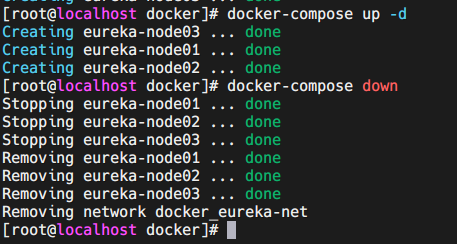
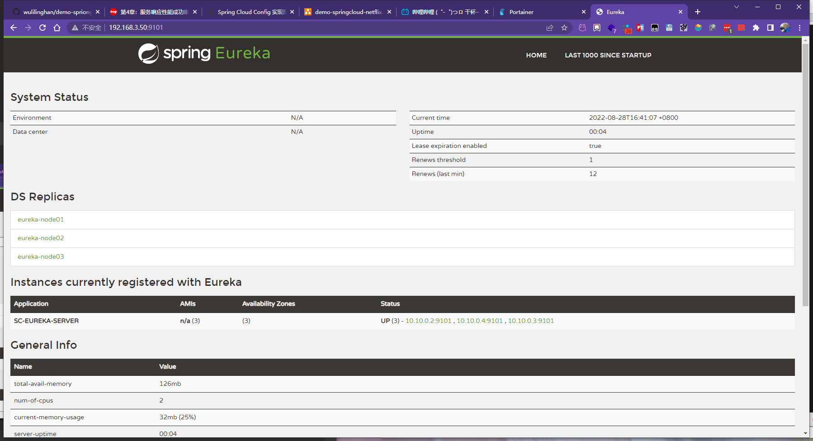

# 一、docker-compose 部署spring cloud eureka集群

## Linux
### 1. docker打构建镜像

maven打成jar后上传至服务器上：



执行打包命令：
```shell
docker build -t sc-eureka-server:1.0.0-SNAPSHOT .
```


查看镜像
```shell
docker images
```


运行镜像
```shell
docker run --name sc-eureka-server --restart always  -p 9101:9101 -d sc-eureka-server:1.0.0-SNAPSHOT
```

浏览器访问

关闭并删除容器


### 2. [docker-compose 安装](https://yeasy.gitbook.io/docker_practice/compose/install)

Docker Desktop for Mac/Windows 自带 docker-compose 二进制文件，安装 Docker 之后可以直接使用。
```shell
$ docker-compose --version

docker-compose version 1.27.4, build 40524192
```
在 Linux 上的也安装十分简单，从 官方 GitHub Release 处直接下载编译好的二进制文件即可。
例如，在 Linux 64 位系统上直接下载对应的二进制包。
```shell
$ sudo curl -L https://github.com/docker/compose/releases/download/1.27.4/docker-compose-`uname -s`-`uname -m` > /usr/local/bin/docker-compose

# 国内用户可以使用以下方式加快下载
$ sudo curl -L https://download.fastgit.org/docker/compose/releases/download/1.27.4/docker-compose-`uname -s`-`uname -m` > /usr/local/bin/docker-compose

$ sudo chmod +x /usr/local/bin/docker-compose

# 卸载命令
$ sudo rm /usr/local/bin/docker-compose
```


### 3. docker-compose 运行
进入docker-compose.yml文件目录下
启动
```shell
docker-compose up -d
```


停止
```shell
docker-compose down
```
启动成功
